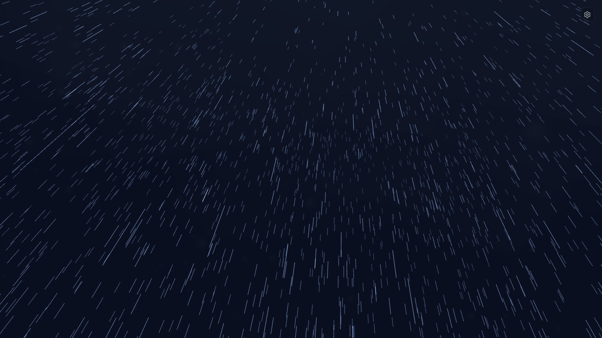

# Rain Simulator

A small Three.js weather scene you can sit with. Rain, clouds, mist, and the occasional bolt of lightning — from a quiet drizzle to a monsoon, depending on how you set the sliders.



## Run it

You will need [Node.js](https://nodejs.org/) and a browser with WebGL.

```bash
npm install
npm run dev
```

Vite starts a local server (usually at http://localhost:5173) and should open the page for you.

To build a static copy and preview it:

```bash
npm run build
npm run preview
```

If the scene does not appear, WebGL is probably unavailable — try another browser, or turn hardware acceleration on.

## Controls

The gear in the top-right opens the panel (`C` to open, `Esc` to close). After a few seconds of stillness, the cursor steps aside so the weather can take the screen.

| Control | What it does |
| --- | --- |
| **Intensity** | Rainfall from 0–100 mm/hr |
| **Wind speed** | Calm at 0, or −50 to 50 km/h (left / right). Rain streaks follow the wind. |
| **Lightning frequency** | None, Rare, Occasional, Medium, Frequent, or Very Frequent |
| **Show FPS counter** | Overlay in the bottom-right |
| **Presets** | Light Drizzle, Steady Rain, Thunderstorm, Monsoon |

## Tinker

TypeScript, Vite, and Three.js. Weather knobs live in `src/config/defaults.ts`. The scene effects — rain, clouds, mist, lightning — sit in `src/effects/`, and the control panel in `src/ui/`.

## License

[MIT](LICENSE)
